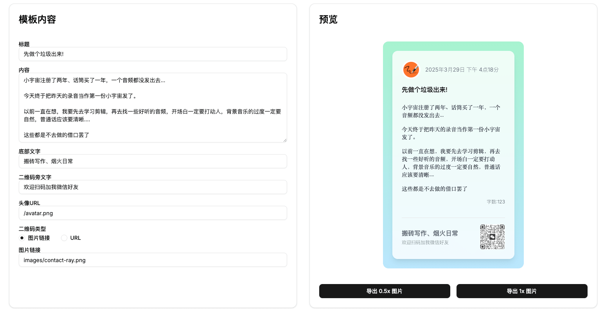
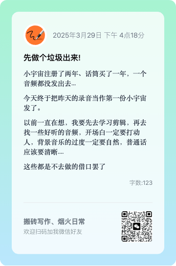
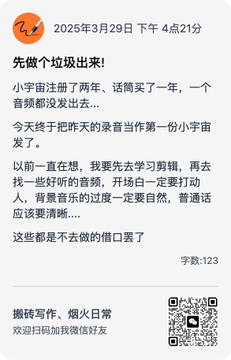

# text2card

text2card 是一个简洁的文字卡片生成工具，可以将文字内容制作成一张漂亮的文字卡片，可以自定义头像、标题、底部文字、链接二维码和图片链接，并导出为图片，然后你可以分享到社交媒体平台。

## 在线地址

[https://text2card2share.vercel.app/](https://text2card2share.vercel.app/)

## 效果展示
### 1.PC端主界面



### 2.PC端导出结果



### 3.移动端导出结果



## 功能特点

- 🎨 简洁美观的卡片设计
- 📱 移动端自适应,并采用不同于PC端的样式
- 📝 自定义标题、内容和底部文字
- 🖼️ 支持添加头像
- 🔗 支持添加自定义链接生成二维码
- 🔗 支持添加图片链接，直接展示图片
- 📱 实时预览效果
- 💾 一键导出为图片，支持0.5倍缩放

## 技术栈

- [Next.js](https://nextjs.org/) - React 框架
- [TailwindCSS](https://tailwindcss.com/) - CSS 框架
- [html2canvas-pro](https://github.com/niklasvh/html2canvas) - HTML 转图片
- [shadcn](https://ui.shadcn.com/) - 组件库
## 使用方法

1. 在左侧编辑区填写：
   - 标题
   - 正文内容
   - 底部文字
   - 头像URL
   - 选择二维码类型：生成二维码或图片链接
   - 输入二维码链接或图片URL（图片链接需注意服务端的跨域问题）  

   > 如果图片链接解决不了跨域问题，也可以放到本地public/images目录下,然后直接在输入框输入路径+图片名称，如：images/contact-ray.png

2. 在右侧实时预览卡片效果

3. 点击导出按钮将卡片保存为图片

## 本地开发
```bash
# 安装依赖
pnpm install
# 启动开发服务器
pnpm run dev

# 如果需要添加其他shadcn组件，如添加radio-group，则需要执行如下安装指令：
npx shadcn@latest add radio-group
```

## 未来计划

- [ ] 添加更多卡片模板
- [ ] 支持自定义背景颜色/图片
- [ ] 支持调整字体大小和样式
- [ ] 移动端适配优化

## 欢迎扫码加我微信


## 请我喝杯咖啡

如果觉得这个项目对你有帮助，请我喝杯咖啡吧！


## 许可证

Apache 2.0
